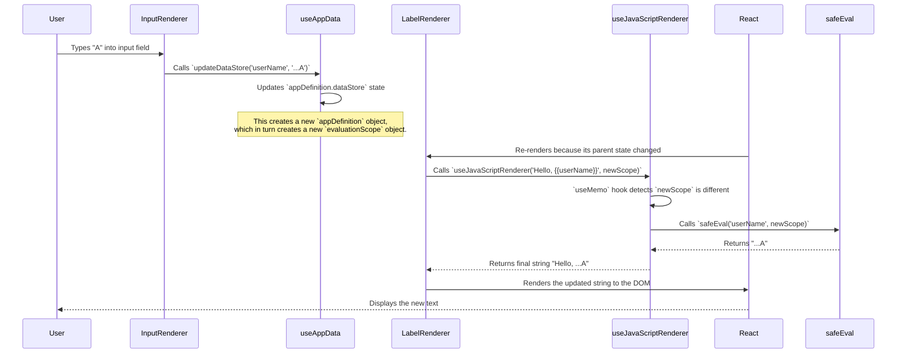
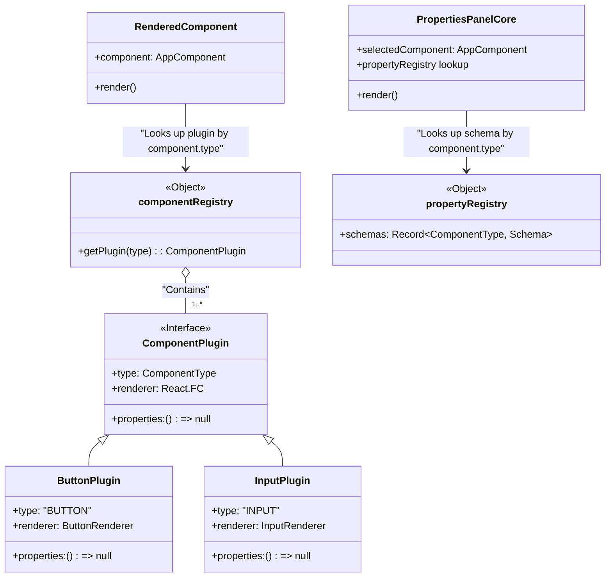

# App Builder: Architecture Overview

This document provides a high-level overview of the App Builder's architecture. It is intended for developers who want to understand the core concepts, data flow, and design principles that govern the system.

For deeper dives into specific topics, please refer to the other documents in this directory:
-   [01-expression-engine.md](./01-expression-engine.md)
-   [02-data-sources.md](./02-data-sources.md)
-   [03-app-data-model.md](./03-app-data-model.md)
-   [04-component-architecture.md](./04-component-architecture.md)
-   [05-import-export.md](./05-import-export.md)
-   [06-app-templates.md](./06-app-templates.md)
-   [07-creating-new-components.md](./07-creating-new-components.md)
-   [08-testing-guide.md](./08-testing-guide.md)
-   [09-state-architecture.md](./09-state-architecture.md)
-   [app-rendering.md](./app-rendering.md)

## 1. Design Philosophy

The architecture is built on three key principles:

1.  **Single Source of Truth**: An entire application is defined by a single, serializable JSON object (`AppDefinition`). This makes persistence, state management, and templating straightforward.
2.  **Extensibility Through Plugins**: The system is designed to be easily extended. New UI components and data providers can be added via a simple plugin pattern without modifying the core editor logic.
3.  **Declarative & Reactive UI**: The application view is a direct, reactive reflection of the state (`AppDefinition`). User interactions modify the state, and the UI automatically updates in response, powered by a sandboxed expression engine.

---

## 2. High-Level System Diagram

This diagram shows the major logical blocks of the application and their primary interactions.

```mermaid
graph TD
    subgraph Browser
        A[Dashboard UI]
        B[Editor UI]
        C[Preview Runtime]
        D[Storage Service (localStorage)]
    end

    subgraph Services
        E[Gemini API Service]
    end

    subgraph External
        F[Google Gemini API]
    end

    A -- "Edits App" --> B
    B -- "Saves App Definition" --> D
    B -- "Loads App Definition" --> D
    A -- "Loads App Metadata" --> D
    B -- "Switches to" --> C
    C -- "Renders App Definition" --> B
    B -- "Sends Prompt" --> E
    E -- "Makes API Call" --> F
    F -- "Returns JSON Layout" --> E
    E -- "Provides Layout to" --> B

    style A fill:#cde4ff
    style B fill:#cde4ff
    style C fill:#cde4ff
    style D fill:#e6e6e6
    style E fill:#d4edda
    style F fill:#f8d7da
```

---

## 3. Editor Architecture

The Editor is the heart of the application. Its architecture is centered around the `useAppData` custom hook, which acts as a central state manager or "controller" for the entire editor UI.

```mermaid
graph TD
    subgraph Editor Core
        useAppData["`useAppData` Hook (State Controller)"]
    end

    subgraph State Modules
        helpers["helpers.ts"]
        componentOps["componentOperations.ts"]
        containerOps["containerOperations.ts"]
        alignmentOps["alignmentOperations.ts"]
        variableOps["variableOperations.ts"]
        evalScope["evaluationScope.ts"]
    end

    subgraph UI Panels
        Palette["Component Palette"]
        Canvas["Canvas"]
        Properties["Properties Panel"]
        AIPrompt["AI Prompt Bar"]
    end

    useAppData -- "imports pure functions" --> helpers
    useAppData -- "imports pure functions" --> componentOps
    useAppData -- "imports pure functions" --> containerOps
    useAppData -- "imports pure functions" --> alignmentOps
    useAppData -- "imports pure functions" --> variableOps
    useAppData -- "imports pure functions" --> evalScope

    useAppData -- "appDefinition (current state)" --> Canvas
    useAppData -- "selectedComponent, appDefinition" --> Properties

    Palette -- "Drags Component" --> Canvas
    Canvas -- "onDrop()" --> useAppData
    Canvas -- "onSelectComponent()" --> useAppData
    Properties -- "updateProp()" --> useAppData
    AIPrompt -- "onGenerate()" --> useAppData

    style useAppData fill:#f9f,stroke:#333,stroke-width:2px
```

### State Management Decomposition

The `useAppData` hook delegates its logic to pure function modules in `src/hooks/state/`:

| Module                     | Responsibility                                         |
|----------------------------|--------------------------------------------------------|
| `helpers.ts`               | Shared utility functions (e.g., immutable updates)     |
| `componentOperations.ts`   | Add, update, delete components                         |
| `containerOperations.ts`   | Container-specific operations (reparent, reorder)      |
| `alignmentOperations.ts`   | Alignment and distribution of child components         |
| `variableOperations.ts`    | CRUD operations for app variables                      |
| `evaluationScope.ts`       | Builds the `evaluationScope` from current state        |

These modules export pure functions that accept and return `AppDefinition` (or parts of it), making them easy to test in isolation without React hooks.

-   **`useAppData` Hook**: Manages the `AppDefinition` state object. It imports pure functions from `src/hooks/state/` and wires them to React state. Any modification creates a new state object, triggering a re-render. It also computes the `evaluationScope` used by the expression engine.
-   **UI Panels**: The `Canvas`, `PropertiesPanel`, and other UI elements are "dumb" components that receive state and callbacks from `useAppData`. They are responsible for rendering the UI and calling the appropriate state modification functions in response to user interaction.

---

## 4. Data Flow & The Reactive Loop

The application's reactivity--the "magic" where the UI instantly updates in response to data changes--is a well-defined process. This sequence diagram illustrates what happens when a user types into a data-bound `Input` component.



This reactive loop is the foundation of the entire preview runtime. Every dynamic property on every component follows this pattern.

---

## 5. Plugin Systems

To ensure extensibility, both UI components and data sources are implemented as plugins that are loaded into a central registry. This decouples the core editor from any specific component or data provider logic.

### Component Plugin Architecture

Each component plugin provides:
- A `renderer` for the canvas/preview
- A `properties` export (returns `() => null`; property editing is handled by the metadata-driven `PropertiesPanelCore`)
- A `paletteConfig` for the component palette



-   The `RenderedComponent` wrapper on the canvas looks up the component's `renderer` from the `componentRegistry` by `type`.
-   The `PropertiesPanelCore` looks up the property schema from the `propertyRegistry` by `type` and renders the property editing UI automatically from metadata.
-   See [04-component-architecture.md](./04-component-architecture.md) for more details.

### Data Source Plugin Architecture

The same pattern applies to data sources, ensuring a standard interface for all data operations.

-   The `useAppData` hook uses the `dataSourceRegistry` to find the correct `DataSourceProvider` implementation when an action (like "Create Record") is triggered.
-   See [02-data-sources.md](./02-data-sources.md) for more details.

---

## 6. AI Integration (`geminiService.ts`)

The AI generation feature is designed as a service that transforms a natural language prompt into a valid piece of the `AppDefinition`.

1.  **Prompt & Context**: The `Editor` captures the user's prompt from the `AIPromptBar`. It passes this prompt, along with the *current* `AppDefinition` (to provide context about available data sources, etc.), to `geminiService.generateAppLayout`.
2.  **System Instruction**: The `geminiService` constructs a detailed system instruction for the Gemini model. This instruction explains the desired JSON schema, the styling rules (e.g., "must use theme variables"), and the available context.
3.  **API Call**: It makes a `generateContent` call to the Gemini API, specifying `responseMimeType: "application/json"` and providing the `responseSchema`. This is a crucial step that instructs the model to return valid, structured JSON.
4.  **Processing**: The service receives the JSON response. It performs post-processing to add default properties, assign the correct `pageId`, and create initial `dataStore` entries.
5.  **State Update**: The service returns a new, complete `AppDefinition` object. The `Editor` then calls `setAppDefinition` with this new object, which updates the entire canvas with the AI-generated layout.
