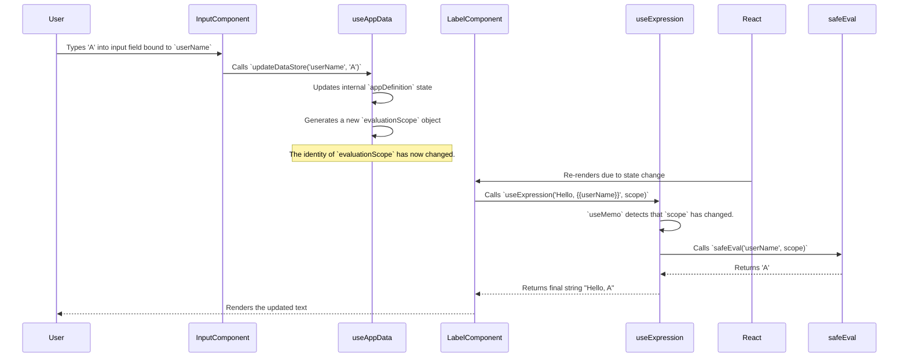

# Architecture Deep Dive: Expression Engine

This document details the design and implementation of the expression engine, a core feature that enables dynamic data binding and logic within the App Builder.

## 1. Goals and Requirements

The primary goal of the expression engine is to allow users to write JavaScript-like expressions to:
- Bind component properties to application state (data store, variables, etc.).
- Create conditional logic (e.g., for visibility or disabled states).
- Perform calculations and data transformations.

The key requirements were:
1.  **Safety**: The engine must be sandboxed to prevent access to global objects like `window` or `document`, mitigating security risks.
2.  **Reactivity**: The UI must update automatically and efficiently whenever data referenced in an expression changes.
3.  **User Experience**: It should gracefully handle syntax errors and incomplete expressions as the user is typing, without crashing or flooding the console with errors.
4.  **Flexibility**: It must support both pure expressions (e.g., `{{ 1 + 1 }}`) and template literals (e.g., `Hello, {{ userName }}`).

## 2. Core Components

The engine is composed of two main parts:
-   **`safeEval` function**: The sandboxed evaluation logic.
-   **`useExpression` hook**: The React hook that integrates `safeEval` into the component lifecycle and provides reactivity.

---

## 3. The `safeEval` Function

This function is the heart of the execution logic, found in `src/expressions/engine.ts`. It takes an expression string and a `scope` object and returns the result.

### Sandboxing Technique

To achieve a safe sandbox, we use the `Function` constructor combined with a `with` statement. This is a standard and effective technique for this use case.

```typescript
// From: src/expressions/engine.ts

export function safeEval(expression: string, scope: Record<string, any>): any {
  const trimmedExpression = expression.trim();
  if (!trimmedExpression) {
    return undefined;
  }

  // The 'with' block creates a scope where the properties of the `scope` object
  // are treated as local variables. This prevents the expression from "leaking out"
  // to access the global scope (e.g., window).
  const funcBody = `with(scope) { return ${trimmedExpression} }`;

  try {
    const func = new Function('scope', funcBody);
    return func(scope);
  } catch (error) {
    // Graceful error handling...
    return undefined;
  }
}
```

The `scope` object contains all the data a user might want to access: `dataStore`, app variables, data source contents, component states, and the app's `theme`.

### Graceful Error Handling

A major challenge is handling errors while a user is typing an expression like `{{ Table1.selectedRecord. }}`. The `safeEval` function includes specific checks for `ReferenceError` and `SyntaxError` to avoid a poor user experience.

---

## 4. The `useExpression` Hook

This React hook, found in `src/expressions/useExpression.ts`, is the bridge between the `safeEval` engine and the React rendering lifecycle. It is used by every component `renderer` for any property that can be dynamic.

### Implementation

The hook uses `React.useMemo` to ensure that expressions are only re-evaluated when their underlying data changes.

```typescript
// From: src/expressions/useExpression.ts

export function useExpression<T>(value: T, scope: Record<string, any>, defaultValue: T): T {
  const result = useMemo(() => {
    if (typeof value !== 'string') {
        return value; // Not an expression, return literal value.
    }

    // Case 1: Pure Expression like "{{ Input1.value }}"
    if (value.startsWith('{{') && value.endsWith('}}')) {
        const expression = value.substring(2, value.length - 2).trim();
        const evaluated = safeEval(expression, scope);
        return evaluated !== undefined ? evaluated : defaultValue;
    }

    // Case 2: Template Literal like "Hello, {{ name }}"
    if (value.includes('{{') && value.includes('}}')) {
        return value.replace(/{{\s*(.*?)\s*}}/g, (match, expression) => {
            const result = safeEval(expression, scope);
            return result !== undefined && result !== null ? String(result) : '';
        });
    }

    // Case 3: Just a literal string.
    return value;

  }, [value, scope, defaultValue]); // The magic is here!

  return result;
}
```

### The Reactive Loop

Reactivity is achieved through the dependency array of `useMemo`: `[value, scope, defaultValue]`.

The `scope` object is generated within the `useAppData` hook and is itself memoized. Whenever any piece of application state changes (e.g., a user types in an `Input`, an app variable is updated, or data is fetched), `useAppData` generates a **new** `scope` object.

This change in the `scope` object's identity triggers the `useMemo` in `useExpression` to re-run for any component property that uses it, thus re-evaluating the expression and updating the UI.

### Diagram: Re-evaluation Flow

Here is a sequence diagram illustrating the entire reactive loop.



---

## 5. Performance

The expression engine uses `new Function()` + `with(scope)` rather than a custom AST parser. Each `safeEval` call goes through three stages: regex sanitization, V8 function compilation, and execution. Despite this per-call compilation overhead, V8 heavily optimizes short function construction, yielding sub-microsecond evaluation times.

### Benchmark Results

Measured via `src/expressions/engine-performance.test.ts` (Node/Jest, single-threaded):

| Metric | Result |
|---|---|
| 10,000 simple expressions (`count + 1`) | ~5.5ms |
| 10,000 complex expressions (ternary + concat + comparison) | ~9ms |
| Mixed expressions evaluated in 50ms | ~52,000 |
| Throughput | ~1,000,000 expressions/sec |
| Average per expression (simple) | ~0.55 us |
| Average per expression (complex) | ~0.90 us |

### Per-Expression-Type Breakdown (1,000 iterations each)

| Expression Type | Example | ops/ms |
|---|---|---|
| Simple variable | `count` | ~1,470 |
| Property access | `Input1.value` | ~1,540 |
| Deep property access | `dataStore.nested.deep.value` | ~1,510 |
| Comparison | `Input2.value > 10` | ~1,615 |
| Ternary | `isAdmin ? "Admin" : "User"` | ~1,590 |
| Arithmetic | `count + total * 2` | ~445 |
| String concatenation | `greeting + " " + dataStore.userName` | ~1,240 |
| Complex (multi-operator) | `Input2.value > 10 && isAdmin ? name + " (" + total + ")" : "N/A"` | ~1,040 |

### Scope Size Impact

Scope size has negligible impact on performance. Evaluating the same expression against a scope with 5 keys vs 500 keys shows a ratio of ~1.0x, because `with()` relies on V8's internal scope chain lookup rather than iterating over object keys.

### `parseDependencies` Performance

The regex-based `parseDependencies` function runs at ~0.90 us per call (10,000 calls in ~9ms).

### Running the Benchmark

Performance tests are excluded from the default Jest run. To execute them:

```bash
npx jest --testPathPattern='engine-performance' --testPathIgnorePatterns='/node_modules/' --verbose
```
