# Architecture Deep Dive: Data Sources

This document explains the pluggable architecture for data sources, which allows the App Builder to connect to various data providers (databases, APIs, browser storage) in a standardized way.

## 1. Goals and Requirements

-   **Extensibility**: The system must be easy to extend. Adding a new data provider (e.g., for Firebase or a REST API) should be straightforward without modifying the core editor logic.
-   **Standardization**: All data providers must conform to a consistent interface for common data operations (CRUD: Create, Read, Update, Delete).
-   **Separation of Concerns**: The UI (Data Panel, Properties Panel) should be decoupled from the implementation details of any specific data provider.
-   **Instance-Based**: Users should be able to create multiple configured *instances* of the same provider type (e.g., two different Local Storage tables).

## 2. Core Components

The architecture consists of three main parts:
1.  **`DataSourceProvider` Interface**: A TypeScript interface that defines the contract all providers must implement.
2.  **`dataSourceRegistry`**: A central object that maps provider IDs to their concrete implementations.
3.  **State Management in `useAppData`**: The editor's main hook manages the list of configured instances and the data fetched from them.

---

## 3. The `DataSourceProvider` Interface

This interface, defined in `src/types.ts` and `src/data-sources/provider.ts`, is the foundation of the system.

```typescript
// From: src/types.ts

export interface DataSourceProvider {
    // Unique ID for the provider type, e.g., "MOCK_DB"
    id: string;
    
    // User-friendly name, e.g., "Mock User Database"
    name: string;
    
    // A short description of the provider.
    description: string;
    
    // A schema to auto-generate a configuration form.
    configSchema: {
        [key: string]: {
            label: string;
            type: 'text' | 'number' | 'textarea';
            defaultValue: any;
        }
    }
    
    // --- Core Data Methods ---
    getRecords: (instance: DataSourceInstance) => Promise<any[]>;
    createRecord: (instance: DataSourceInstance, data: any) => Promise<any>;
    updateRecord: (instance: DataSourceInstance, recordId: any, updates: any) => Promise<any>;
    deleteRecord: (instance: DataSourceInstance, recordId: any) => Promise<boolean>;
}

// Represents a user's configured instance of a provider.
export interface DataSourceInstance {
    id: string; // Unique name given by user, e.g., "myUsers"
    providerId: string; // The ID of the provider, e.g., "MOCK_DB"
    config: Record<string, any>; // Configuration data matching the provider's schema
}
```

By enforcing this contract, any part of the application can interact with any data source without needing to know its internal logic.

---

## 4. The `dataSourceRegistry`

This is a simple but crucial object located at `src/data-sources/registry.ts`. It acts as a directory, allowing the application to look up a provider's implementation by its unique `id`.

```typescript
// From: src/data-sources/registry.ts

import { DataSourceProvider } from './provider';
import { MockDbProvider } from './MockDbProvider';
import { LocalStorageProvider } from './LocalStorageProvider';

export const dataSourceRegistry: Record<string, DataSourceProvider> = {
    [MockDbProvider.id]: MockDbProvider,
    [LocalStorageProvider.id]: LocalStorageProvider,
    // To add a new provider, you would import it and add it here.
};
```

When a user performs an action, the `useAppData` hook manages data source operations through the `dataSourceRegistry`. The hook uses the instance's `providerId` to look up the correct provider and call its methods (e.g., `.createRecord()`, `.updateRecord()`, `.deleteRecord()`).

---

## 5. State Management in `useAppData`

The `useAppData` hook manages two key pieces of state related to data sources:

1.  **`appDefinition.dataSources`**: This is an array of `DataSourceInstance` objects. It represents the *configuration* of data sources for the app and is saved as part of the app's definition.
2.  **`dataSourceContents`**: This is a `useState` variable of type `Record<string, any[]>`. It holds the actual *data* fetched from each data source. The key is the instance ID (e.g., `myUsers`), and the value is the array of records. This data is **transient** and is not saved with the app definition; it's re-fetched every time the app loads.

### Fetching Logic

The `refreshDataSource` function in `useAppData` handles the data fetching:

```typescript
// Simplified from: src/hooks/useAppData.ts

const { dataSources: dataSourceInstances } = appDefinition;
const [dataSourceContents, setDataSourceContents] = useState<Record<string, any[]>>({});

const refreshDataSource = useCallback(async (instanceId: string) => {
    // 1. Find the instance configuration from the app definition.
    const instance = dataSourceInstances.find(ds => ds.id === instanceId);
    if (!instance) return;

    // 2. Look up the provider implementation in the registry.
    const provider = dataSourceRegistry[instance.providerId];
    if (!provider) return;

    // 3. Call the provider's getRecords method.
    const records = await provider.getRecords(instance);

    // 4. Store the fetched data in the transient state.
    setDataSourceContents(prev => ({ ...prev, [instance.id]: records }));
}, [appDefinition]); // Depends on appDefinition to avoid stale closures

// This useEffect ensures all data sources are fetched on initial load.
useEffect(() => {
    dataSourceInstances.forEach(instance => {
        refreshDataSource(instance.id);
    });
}, [dataSourceInstances, refreshDataSource]);
```

When this `dataSourceContents` state is updated, it triggers a change in the `evaluationScope`, which in turn causes components like Tables to re-render with the new data.

### Diagram: Architecture Overview

This diagram shows the relationship between the key architectural components.

```mermaid
classDiagram
    class useAppData {
        +appDefinition: AppDefinition
        +dataSourceContents: Record
        +refreshDataSource(id)
    }
    class AppDefinition {
        +dataSources: DataSourceInstance[]
    }
    class DataSourceInstance {
        +id: string
        +providerId: string
    }
    class dataSourceRegistry {
        +getProvider(id): DataSourceProvider
    }
    class DataSourceProvider {
        <<Interface>>
        +id: string
        +getRecords()
        +createRecord()
    }
    class MockDbProvider {
        +id: "MOCK_DB"
        +getRecords()
    }
    class LocalStorageProvider {
        +id: "LOCAL_STORAGE"
        +getRecords()
    }

    useAppData --> AppDefinition : "manages state of"
    AppDefinition --> "0..*" DataSourceInstance : "contains"
    useAppData --> dataSourceRegistry : "uses"
    dataSourceRegistry --> "1" DataSourceProvider : "looks up"
    DataSourceProvider <|-- MockDbProvider
    DataSourceProvider <|-- LocalStorageProvider

```


