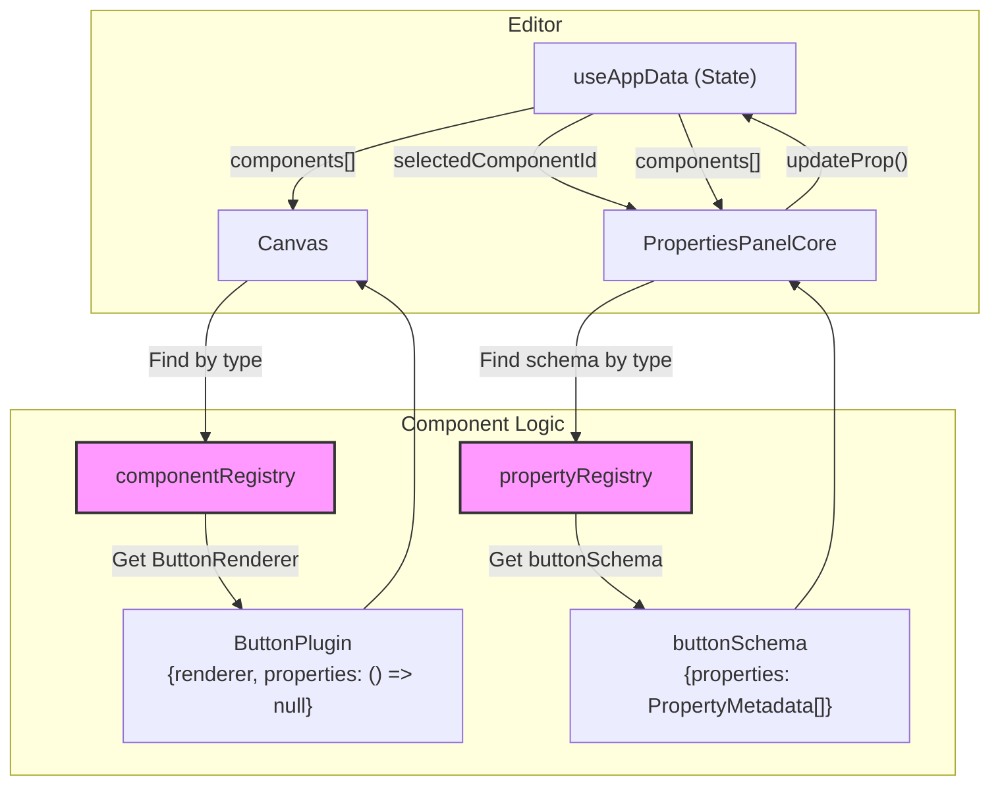

# Architecture Deep Dive: Component Architecture

This document outlines the pluggable component architecture, which is designed to make adding new, fully-featured UI components to the App Builder as simple as possible.

## 1. Goals and Requirements

-   **Extensibility**: Adding a new component should not require changing core editor files like `Canvas.tsx` or `PropertiesPanel.tsx`.
-   **Encapsulation**: All logic related to a specific component type--its rendering, its default settings, and its property schema--should be co-located or easily discoverable.
-   **Standardization**: All components must adhere to a common interface (`ComponentPlugin`) so the editor knows how to interact with them.
-   **Decoupling**: The rendering logic (`renderer`) is separate from the property editing, which is handled entirely by the metadata-driven `PropertiesPanelCore`.

## 2. The `ComponentPlugin` Interface

The core of the system is the `ComponentPlugin` interface defined in `src/types.ts`. Every component in the builder is defined by an object that implements this interface.

```typescript
// From: src/types.ts

export interface ComponentPlugin {
  // A unique identifier from the ComponentType enum.
  type: ComponentType;

  // Defines how the component appears in the left-hand palette.
  paletteConfig: {
    label: string; // e.g., "Text Input"
    icon: React.ReactNode; // SVG icon
    defaultProps: Record<string, any>; // Initial props for a new instance
  };

  // A React component that renders the component on the canvas.
  renderer: React.FC<any>;

  // Returns null. Property editing is handled by PropertiesPanelCore using registered schemas.
  properties: React.FC<any>;

  // Optional: If true, other components can be dropped inside this one.
  isContainer?: boolean;
}
```

The `properties` field returns `() => null` for all components. The actual property editing UI is rendered by `PropertiesPanelCore`, which looks up the component's property schema from the `propertyRegistry` by `ComponentType`.

## 3. The `componentRegistry`

The registry, located at `src/components/component-registry/registry.ts`, is a simple object that maps a `ComponentType` enum to its corresponding `ComponentPlugin` implementation.

```typescript
// From: src/components/component-registry/registry.ts

import { ComponentType, ComponentPlugin } from '../../types';
import { ButtonPlugin } from './Button';
import { InputPlugin } from './Input';
// ... other imports

export const componentRegistry: Record<ComponentType, ComponentPlugin> = {
    [ComponentType.BUTTON]: ButtonPlugin,
    [ComponentType.INPUT]: InputPlugin,
    // ... other component plugins
};
```
This registry acts as a central directory that the rest of the application uses to look up the correct renderer for any given component.

## 4. The Property Schema System

Property editing is entirely schema-driven. Each component has a property schema defined in `src/components/properties/schemas/`.

### How Schemas Work

1. A schema is a `ComponentPropertySchema` object containing `PropertyMetadata` entries organized into tabs and groups.
2. `createPropertySchema()` merges component-specific properties with `commonProperties` (layout, state, styling, border).
3. Schemas are registered at startup via `registerAllPropertySchemas()`.
4. `PropertiesPanelCore` looks up the schema by `ComponentType` and renders the UI automatically.

### Schema File Structure

```typescript
// From: src/components/properties/schemas/button.ts

import { ComponentType } from '../../../types';
import { ComponentPropertySchema, PropertyMetadata, PropertyGroup } from '../metadata';
import { commonProperties, commonTabs, commonGroups, createPropertySchema } from '../registry';

const buttonProperties: PropertyMetadata[] = [
  {
    id: 'text',
    label: 'Text',
    type: 'expression',
    defaultValue: 'Click Me',
    supportsExpression: true,
    group: 'Basic',
    tab: 'General',
    tabOrder: 0,
    groupOrder: 0,
    propertyOrder: 0,
    applicableTo: [ComponentType.BUTTON],
    tooltip: 'Button text content',
  },
  // ... more properties
];

export const buttonSchema: ComponentPropertySchema = createPropertySchema(
  ComponentType.BUTTON,
  buttonProperties,
  commonTabs,
  [...commonGroups, ...buttonGroups]
);
```

### Key Files

| File | Purpose |
|------|---------|
| `src/components/properties/metadata.ts` | Type definitions: `PropertyMetadata`, `PropertyType`, `ComponentPropertySchema` |
| `src/components/properties/registry.ts` | `propertyRegistry`, `commonProperties`, `commonTabs`, `createPropertySchema()` |
| `src/components/properties/schemas/` | One schema file per component (16 total) |
| `src/components/PropertiesPanelCore.tsx` | Renders property UI from schema metadata |

## 5. How It Works: Rendering and Interaction Flow

### Rendering on the Canvas

1.  The `Canvas` component receives the list of components for the current page. It filters for root-level components (those with no `parentId`) and maps over them.
2.  For each component, it renders a `RenderedComponent` wrapper.
3.  The `RenderedComponent` wrapper is responsible for handling generic editor interactions: selection highlighting, drag-and-drop, resizing, and the delete button.
4.  `RenderedComponent` looks up the component's plugin in the `componentRegistry` using its `type`.
    ```typescript
    // Simplified from: src/components/RenderedComponent.tsx
    const plugin = componentRegistry[component.type];
    const ComponentRenderer = plugin.renderer;
    // ...
    return <ComponentRenderer {...props} />;
    ```
5.  It then renders the specific `renderer` provided by the plugin, passing down all necessary props like `component`, `mode`, `evaluationScope`, `actions`, etc.
6.  If a component is a container (`isContainer: true`), its `renderer` will also render its `children`, which are recursively rendered `RenderedComponent` instances.

### Editing in the Properties Panel

1.  When a user clicks on a component, its ID is stored in the `selectedComponentId` state.
2.  `PropertiesPanelCore` receives this ID and finds the full component object.
3.  It looks up the property schema from the `propertyRegistry` by `ComponentType`.
4.  It renders the property editing UI automatically: tabs, collapsible groups, and individual property inputs based on the `PropertyMetadata` entries.
5.  When the user changes a property value, `PropertiesPanelCore` calls `updateProp()` to inform `useAppData` of the change.

### Diagram: Component Data Flow

This diagram illustrates how the `componentRegistry` and `propertyRegistry` decouple the core editor from the specific component implementations.



## 6. How to Add a New Component

Creating a new component plugin is the primary way to extend the builder's functionality.

1.  **Define Types (`types.ts`)**: Add a new `ComponentType` enum value, create a `YourComponentProps` interface (extending `BaseProps`), and add it to the `ComponentProps` union type.
2.  **Create Plugin File (`/component-registry/YourComponent.tsx`)**:
    *   **Create the Renderer**: A React component that visually represents your component on the canvas.
    *   **Set `properties: () => null`**: Property editing is handled by the schema.
    *   **Define the Plugin Object**: Create the `YourComponentPlugin` object, linking your `type`, `paletteConfig`, `renderer`, and `properties: () => null`.
3.  **Create Property Schema (`/properties/schemas/yourComponent.ts`)**: Define `PropertyMetadata` entries for your component's specific properties. Use `createPropertySchema()` to merge with `commonProperties`.
4.  **Register the Schema (`/properties/schemas/index.ts`)**: Import your schema and add a `registerPropertySchema(yourComponentSchema)` call in `registerAllPropertySchemas()`.
5.  **Register the Plugin (`/component-registry/registry.ts`)**: Import your new plugin and add it to the `componentRegistry` object.

See [07-creating-new-components.md](./07-creating-new-components.md) for a detailed step-by-step guide with code examples.
