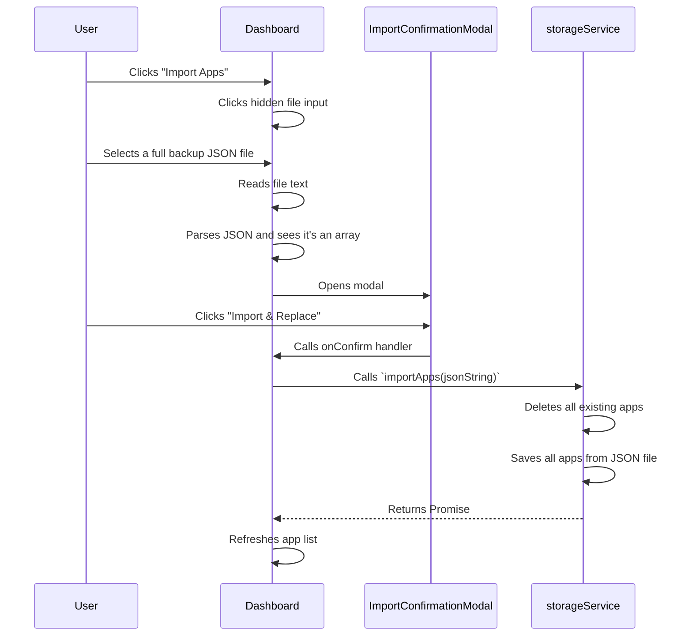

# Architecture Deep Dive: Import & Export

This document explains the technical implementation of the application's import and export functionality, which is crucial for backups, sharing, and migrating applications between browsers or environments.

## 1. Goals and Requirements

-   **Completeness**: Exports must contain the entire state of an application (`AppDefinition`) to ensure a perfect restoration.
-   **Flexibility**: Support exporting a single application as well as a full backup of all applications.
-   **Robustness**: The import process must handle both single-app files and full backups, with clear warnings for destructive actions (like overwriting all existing data).
-   **Simplicity**: The underlying mechanism should rely on a simple, human-readable format (JSON).

## 2. Core Logic: `storageService.ts`

All the heavy lifting for import and export is handled by the `storageService`, which provides an abstraction over the browser's `localStorage`.

### Exporting Logic

1.  **Export Single App (`exportSingleApp`)**:
    -   This function takes an `appId` as an argument.
    -   It calls `getApp(id)` to retrieve the full `AppDefinition` object from storage.
    -   It uses `JSON.stringify(app, null, 2)` to convert the object into a nicely formatted JSON string.
    -   This string is returned to the caller (`Dashboard.tsx`).

    ```typescript
    // From: src/storageService.ts
    async exportSingleApp(id) {
        const app = await this.getApp(id);
        if (!app) {
          throw new Error("App not found for export");
        }
        return JSON.stringify(app, null, 2);
    }
    ```

2.  **Export All Apps (`exportAllApps`)**:
    -   This function first calls `getAllAppsMetadata()` to get the list of all app IDs.
    -   It then iterates through this list, calling `getApp(id)` for each one.
    -   `Promise.all` is used to fetch all app definitions concurrently.
    -   The resulting array of `AppDefinition` objects is then stringified into a single JSON array.

    ```typescript
    // From: src/storageService.ts
    async exportAllApps() {
        const metadata = await this.getAllAppsMetadata();
        const allApps = await Promise.all(
          metadata.map(appMeta => this.getApp(appMeta.id))
        );
        const validApps = allApps.filter(app => app !== null);
        return JSON.stringify(validApps, null, 2);
    }
    ```

### Importing Logic (`importApps`)

This is the most critical and potentially destructive part of the service.

1.  The function receives a single JSON string.
2.  It calls `JSON.parse(jsonString)`.
3.  **It checks the structure of the parsed data**:
    -   If `Array.isArray(dataToImport)` is `true`, it assumes a **full backup**.
    -   Otherwise, it assumes a **single app import**.
4.  **Full Backup Workflow**:
    -   The function iterates through all existing apps and **deletes them** from `localStorage`.
    -   It then clears the central application index (`APPS_INDEX_KEY`). This is the **destructive replace** operation.
    -   Finally, it iterates through the imported array of apps and calls `saveApp` for each one, effectively rebuilding the entire application database from the backup file.
5.  **Single App Workflow**:
    -   It simply calls `saveApp` with the single `AppDefinition` object. If an app with the same ID already exists, it will be overwritten.

```typescript
// From: src/storageService.ts
async importApps(jsonString) {
    const dataToImport = JSON.parse(jsonString);
    
    // Check if it's a full backup (array of apps)
    if (Array.isArray(dataToImport)) {
      // THIS IS THE DESTRUCTIVE PART
      const currentApps = await this.getAllAppsMetadata();
      currentApps.forEach(app => localStorage.removeItem(`${APP_DATA_PREFIX}${app.id}`));
      localStorage.removeItem(APPS_INDEX_KEY);

      for (const app of dataToImport) {
        await this.saveApp(app);
      }
      return;
    }
    
    // Otherwise, it's a single app import
    const app = dataToImport as AppDefinition;
    await this.saveApp(app);
}
```

## 3. UI Interaction: `Dashboard.tsx`

The `Dashboard` component orchestrates the user-facing side of the import/export process.

### Export Flow

1.  The user clicks an "Export" or "Export All" button.
2.  The corresponding handler (`handleExportSingleApp` or `handleExportAll`) is called.
3.  The handler calls the appropriate `storageService` method.
4.  It takes the returned JSON string and creates a `Blob`.
5.  It creates an object URL from the Blob (`URL.createObjectURL`).
6.  It dynamically creates an `<a>` element, sets its `href` to the object URL and its `download` attribute to a generated filename.
7.  It programmatically clicks the link to trigger the browser's file download dialog.
8.  Finally, it cleans up by removing the `<a>` element and revoking the object URL.

### Import Flow

1.  The `Dashboard` has a hidden `<input type="file" ref={fileInputRef}>`.
2.  The "Import" button programmatically clicks this hidden input.
3.  When the user selects a file, the input's `onChange` event fires (`handleFileChange`).
4.  The handler reads the file content as text using `file.text()`.
5.  It attempts to `JSON.parse` the text to "peek" at its structure.
6.  If the parsed data is an array, it knows this is a full backup. It stores the raw text in a state variable (`importData`) which triggers the `ImportConfirmationModal` to appear, warning the user about the destructive nature of the action.
7.  If the parsed data is an object, it assumes a single app import and immediately calls `storageService.importApps()` without a confirmation modal.
8.  If the user confirms in the modal, `handleConfirmImport` is called, which then invokes `storageService.importApps()` with the stored text.

### Diagram: Import Confirmation Flow


