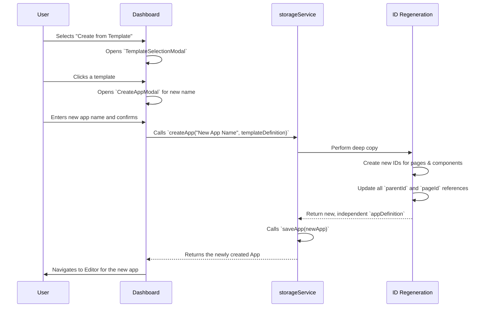

# Architecture Deep Dive: App Templates

This document explains the technical design and implementation of the app templating feature, which allows users to save existing applications as reusable starters.

## 1. Goals and Requirements

-   **Reusability**: Allow users to save any app as a template.
-   **Independence**: An app created from a template must be a completely independent copy. It should not share any references or IDs with the original template. This is the most critical requirement.
-   **Simplicity**: The process of creating and using templates should be intuitive from the user's perspective.
-   **Data Integrity**: The templating process must preserve the entire structure of the original app, including pages, component layouts, data source configurations, variables, and themes.

## 2. Data Model

A new data structure, `AppTemplate`, is introduced in `src/types.ts`.

```typescript
// From: src/types.ts

export interface AppTemplate {
  id: string; // Unique ID for the template itself
  name: string;
  description: string;
  imageUrl: string; // Base64 encoded thumbnail
  appDefinition: AppDefinition; // A complete snapshot of the original app
}
```
The key design choice is to store a full, deep copy of the `AppDefinition` within the template object. This makes each template self-contained. Templates are stored under a separate key in `localStorage`.

## 3. Saving an App as a Template

The flow for saving a template is straightforward:

1.  **User Action**: The user clicks "Save as Template" from an app's menu on the `Dashboard`.
2.  **Modal Display**: The `Dashboard` opens the `SaveAsTemplateModal`, passing the app's metadata.
3.  **Data Collection**: The modal collects the template's `name`, `description`, and an optional `imageUrl` from the user.
4.  **Persistence**:
    -   When the user clicks "Save", the `Dashboard`'s `handleSaveAsTemplate` function is called.
    -   It first calls `storageService.getApp()` to fetch the *full `AppDefinition`* of the app being templated.
    -   It then constructs a new `AppTemplate` object, combining the user-provided details with the fetched `appDefinition`.
    -   Finally, it calls `storageService.saveTemplate()`, which serializes the `AppTemplate` object and saves it to `localStorage`.

## 4. Creating an App from a Template

This is the most complex part of the feature, where the requirement for complete independence is fulfilled.

### The ID Conflict Problem

If we were to simply copy the `appDefinition` from the template to a new app, the new app would have the exact same page IDs and component IDs as the template. This would cause major issues, as IDs must be unique across the entire system.

### The Solution: Deep Copy and ID Regeneration

The core logic resides within the `createApp` method of the `storageService`. When called with a `templateDefinition`, it performs a multi-step regeneration process.

```typescript
// Simplified logic from: src/storageService.ts

async createApp(name, templateDefinition) {
    if (!templateDefinition) {
      // ... logic for creating a blank app ...
      return;
    }

    // 1. Deep copy to prevent mutating the original template object.
    const newAppDef = JSON.parse(JSON.stringify(templateDefinition));

    // 2. Create maps to track old IDs to new IDs.
    const pageIdMap = new Map<string, string>();
    const componentIdMap = new Map<string, string>();

    // 3. First Pass: Regenerate all IDs and populate the maps.
    newAppDef.pages.forEach((page: AppPage) => {
        const oldId = page.id;
        const newId = `page_${Date.now()}_${index}`;
        page.id = newId;
        pageIdMap.set(oldId, newId);
    });

    newAppDef.components.forEach((component: AppComponent) => {
        const oldId = component.id;
        const newId = `${component.type}_${Date.now()}_${index}`;
        component.id = newId;
        componentIdMap.set(oldId, newId);
    });

    // 4. Second Pass: Update all references using the maps.
    newAppDef.components.forEach((component: AppComponent) => {
        // Update parentId to the new parent's ID.
        if (component.parentId) {
            component.parentId = componentIdMap.get(component.parentId) || null;
        }
        // Update pageId to the new page's ID.
        component.pageId = pageIdMap.get(component.pageId)!;
    });

    // 5. Update the mainPageId reference.
    newAppDef.mainPageId = pageIdMap.get(newAppDef.mainPageId)!;
    
    // ... create the final AppDefinition with new name, id, etc. ...
    
    return this.saveApp(finalApp);
}
```

This process guarantees that the newly created app is a structurally identical but completely distinct entity from the template it was based on.

### Diagram: "Create from Template" Flow


